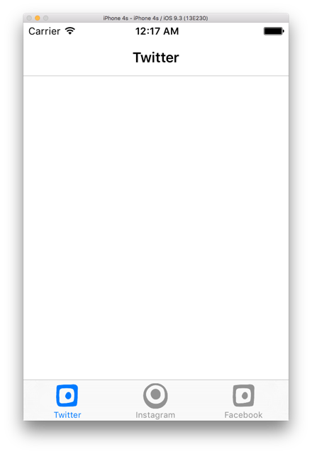

## สร้าง Tabbed Page แบบง่าย



## โครงสร้างโปรเจค

```
├── Droid
│   ├── MainActivity.cs
│   └── Properties
│       └── AssemblyInfo.cs
├── SwitchingTabbedPageDemo
│   ├── App.cs
│   ├── MainTabbedPage.cs
│   ├── Properties
│   │   └── AssemblyInfo.cs
│   └── Views
│       ├── FacebookPage.cs
│       ├── InstagramPage.cs
│       └── TwitterPage.cs
└── iOS
    └── AppDelegate.cs
```

## ไฟล์ `MainTabbedPage.cs`

```csharp
public class MainTabbedPage : TabbedPage {
    public MainTabbedPage() {
        var twitter = new NavigationPage(new TwitterPage()) {
            Title = "Twitter",
            Icon = "square.png"
        };
        var instagram = new NavigationPage(new InstagramPage()) {
            Title = "Instagram",
            Icon = "circle.png"
        };
        var facebook = new NavigationPage (new FacebookPage ()) {
            Title = "Facebook",
            Icon = "square.png"
        };
        Children.Add (twitter);
        Children.Add (instagram);
        Children.Add (facebook);
    }
}
```

## ไฟล์ `TwitterPage.cs`

```csharp
public class TwitterPage : ContentPage {
    public TwitterPage() {
        Title = "Twitter";
        Icon = "circle.png";
    }
}
```
